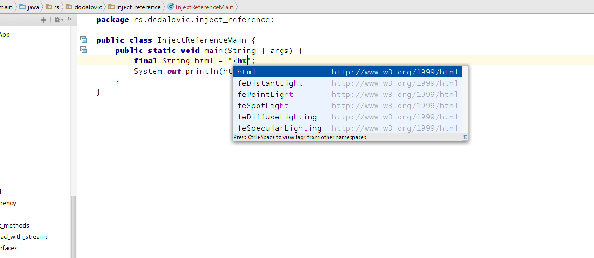
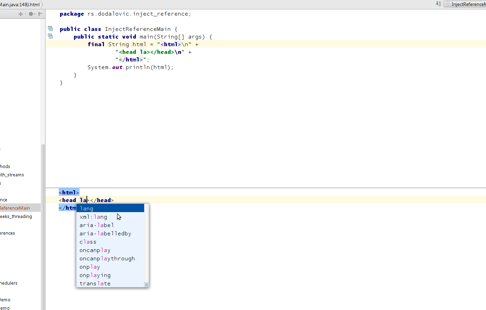
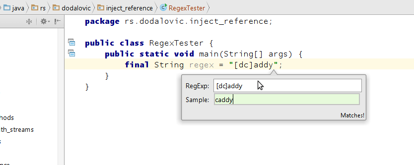

One of very neat features of Intellij IDEA that I came across is injecting language / reference feature into `String` object.

<!--truncate-->

Let's jump to code straight away to do simple example:

```java
package rs.dodalovic.inject_reference;

public class InjectReferenceMain {
    public static void main(String[] args) {
        final String html = "";
        System.out.println(html);
    }
}
```

Say we'd quickly want to put some html code into html `String` variable. We could manually start typing code in, but there's always
formatting and escaping double quotes issue in there - that makes us more careful than we don't need to be actually. `IDEA` helps us
avoiding this burden, by doing following:

- position mouse cursor inside "" `String` value
- press `Alt + Enter` keyboard combination
- select `Inject language or reference` and press `Enter`
- pick `HTML` from the list and press `Enter`

Now, value inside `String` is context aware, which means that you have code assist now when you want to type the value of `String`.
You can type `<ht`  and press `Control + Space` combination to get code assist. Once doing so - you can see you're getting `html` aware
help:



In this case, we're creating `HTML` context, but there are many things you can choose from drop down list, like `JSON`, `XML` and so forth.
In this case you'll get also `HTML` attributes completion (you can even open `<script>` tag and get `Javascript` support inside! )

You can also open separate editor to modify html, by pressing `Alt + Enter` inside `String` value again, and choosing `Edit HTML Fragment`
and pressing `Enter`. You will be presented with new editor where you can directly deal with `html` only:



You can see that it directly changes `Java` code as you type in this new editor. Once you complete typing, you can close this editor by
pressing `Ctrl + F4` combination.

Once you're complete with html coding, you can un-inject language reference (this should give you back some performance, since Intellij
doesn't need to provide context sensitive information for `String` anymore. Go to `String` value, and press `Alt + Enter`, and select
`Un-inject Language/Reference` option.

Another, particularly useful case is `RegExp` choice, which can give you opportunity to test your inputs against regex you build.
Just, as described above, inject `RegExp` flavor into `String`. After that, using `Alt + Enter`, choose `Check RegExp` option.
You'll get popup such as one below, which will let you test your regex against various inputs:



Go - experiment with various contexts apart from `HTML` and `RegExp` one which we showcased.

That was all for today! Hope you liked it!
