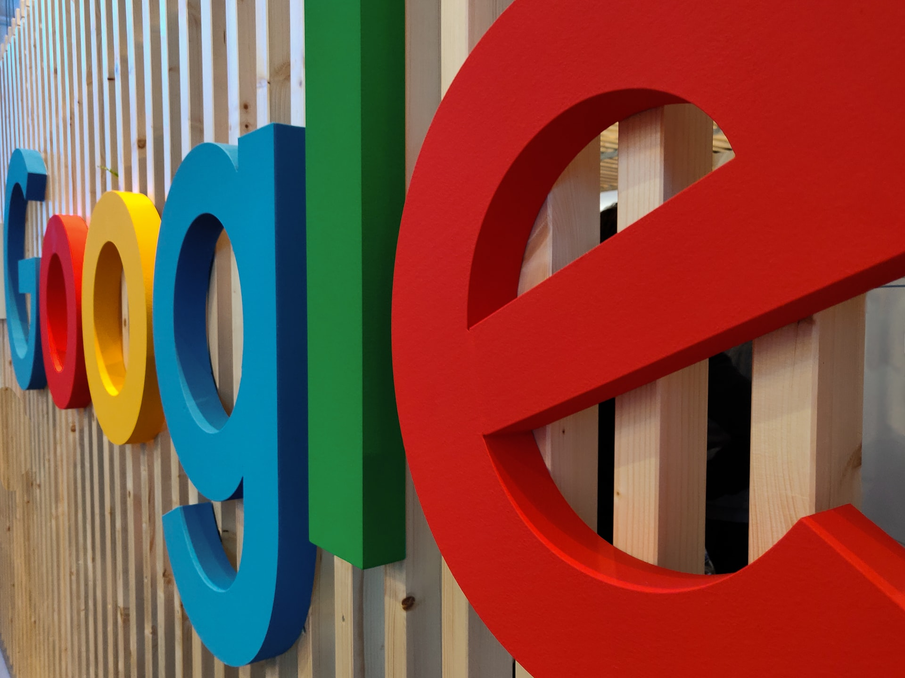

Last week I bought a second hand **Google Pixelbook** since I was quite intrigued by the fact that there is a Linux based OS, backed by Google, which I could at least test, after years spent with MacOS.

macOS is a really fine polished product. And what about the **Chrome OS**?

Curious to read about my impressions so far, from the angle of a software developer?

Let's dive in!

## The machine specs

Here are the specs of the machine:

```
Android: 9
Processor: Intel(R) Core(TM) i5-7Y57 CPU @ 1.20GHz
CPU Max Frequency: 3300 Mhz
CPU Cores: 4
System RAM: 7.69 GB
GPU: Intel Open Source Technology Center Mesa DRI Intel(R) HD Graphics 615 (Kaby Lake GT2)
Audio Chipset: Eve
Internal Storage: 220.27 GB (208.36 GB Free)
Display Size: 3000x2000 (14.99")
Screen Density: 240 ppi (240 dpi)
```
It's relatively decent piece of hardware, nothing fancy, machine capable of handling some decent workload.

## Learning curve

As with anything new, it takes some time to get used to something that looks and feels different from what you're used to.

It took me **a day or two** to get the idea of how things work in Chrome OS. Once you
get the basics, you start to enjoy the built-in functionalities, such as built-in Google Assistant, easy search,
navigation, hybrid applications ecosystem, and so on.

## Promising project

The fact that Google put their name next to this project may let us believe that Linux based OS (Chrome OS is based on **Crostini OS**) could be a more serious contender in the world of desktop operating systems.

> Crostini is Google's umbrella term for making Linux application support easy to use and integrates well with Chrome OS.

Right now, **Chrome OS** can't be compared to **macOS** and **Windows** in terms of features supported, stability, application ecosystem, etc.

The advantage of Chrome OS is that it might be the lightest of all the desktops at the moment, since it can be installed on the old machines as well, and should be quite decent.

If Chrome OS gets more stable and the application ecosystem gets way better, the fact that it can run on
moderate hardware as well could help it gain significant market share in the future.

If it's of any importance, even [Linus Torvalds said](https://www.youtube.com/watch?v=P1wzIqgT6uY) that Chrome OS might be the way for Linux to penetrate the desktop OS market.

Time will tell.

## The weird ecosystem of applications

The story about the Chrome OS application ecosystem is complicated. Chrome OS supports:

- Web applications (classical websites)
- Progressive web applications
- Linux (`.deb` packaged) applications
- Android (Google Play) applications

Having all of these applications available could be somewhat confusing for the users. When you
want to launch some applications using the application launcher, you are presented with all installed
applications. You will not know, most of the time, which **kind of app** it is. In theory, you may not even
care, as long as they all look good and work great.

But that's not the case yet, since, for instance, Android applications are most of the time **not responsive to the viewport given**.

Linux applications also for some reason do not look that good as well or lack quite some functionalities they have in MacOS.

We'll see how things will be in the future.

## Sluggish, buggy at the time


Nothing is perfect, of course. Especially Chrome OS underneath.

Multiple times a day I can experience things freezing, getting slow, or similar.

Most of the time things get back to normal after I close and reopen the laptop lid.

Animations can also **get slower**, and response to my actions is delayed. It also happens that applications do not even launch after I click their launcher icon. They may launch with a significant delay eventually.

After every fresh boot, after I'm presented with a desktop, it takes a minute or so until my clicks on some apps are being processed. For instance, I usually open a terminal as soon as I'm logged in, but it takes around a minute
or so until the terminal is usable.

In general, a couple of restarts a day and you survive this very unpleasant behavior.

## Very lightweight


This device is very portable, which I enjoy. It's slightly heavier than my IPad Pro but is a different kind of
device.

Build quality is really good, it doesn't feel cheap, and all in all - this is a very pleasant piece of hardware
to work with.

## Bad sound and Bluetooth, not ideal WiFi

You will probably not enjoy the sound coming from this box, but I don't care for this on this machine, and
it's more than enough for my needs.

One thing that works badly at the time being is Bluetooth, and using my **Bose QC35** is just an unpleasant experience.
The connection often drops, there are some interruptions quite often, that you can hear as well. But the thing is that
the headphone jack is there, so you can use something else.

I also had issues when I connected to my home WiFi 5GHz network since it wasn't able to connect via 5GHz, rather defaulted to 2.4 GHz. This may have happened because I first time connected from a room that was a bit further away from the router. But, my **IPad was able to connect** from the same place to the 5GHz network without any issues.
I disconnected and reconnected again while being close to the router, which made it work from then on somehow.

It's a bit weird but OK.

## Great keyboard


The keyboard is probably the most exciting part of this story. It's more than pleasant to work with. I don't
know about the exact key travel details for this device, but, in simple words - it works well.

It's also a backlit keyboard, and that's for me quite handy since I'm typing quite a lot in the evening.

The only drawback I see is that you can set that the keyboard's top row is interpreted as function keys, instead of standard volume up / down, brightness and such, but the issue is that there aren't 12 twelve buttons in total in this top row, and not sure how all of this would work. Some shortcuts I frequently use involve function keys (IntelliJ IDEA ones),
and this is a productivity issue for me, which forces me to not use these shortcuts.

## Touchpad almost as good as a Macbook's one

I'm satisfied in general with the way the Touchpad works on this machine. It's not exactly at the level of Macbook's one, especially in terms of size, but the overall feel and the precision weren't bad at all.

I'd say that the size is ok overall, and I didn't have any issues with that. Also, I got used to the fact that it's not ideally precise, but with the time I mastered it, so now I'm quite efficient using it.

## Good cooling

Another good thing about this product is that during this week, I wasn't hearing CPU fans at all, and I was using CPU intensively while
using IntelliJ, for instance. This is, indeed, very nice!

## Not yet there

As you may have guessed already, this device is **not yet there**. The reason I bought it was that it was a used one, and
the price was acceptable. The fact I could, in theory, use Linux and rely on Google having the interest to support this story made me believe the purchase of Pixelbook may be well worth it.

I believe that Chrome OS and the Linux beneath it will get mature with the time.

That's at least my hope.

Anyways, it's always good to have many competitors in the desktop operating systems space, so that it forces all the vendors to push harder to deliver us more for the money we give.

## Google's name is associated with this product



For me, it was very exciting to see that Linux based OS is trying to find its way to the end consumers. Right now, the percentage of people using Linux desktops is very low, close to non-existent.

I am hoping that Google has enough power and interest to push this story long-term and that the stability and quality of this new Linux distribution called **Crostini** will get way better than it is right now.

Now... there is a chance that this may become a dead-end project, since there were cases of some Linux based tablets in the past, and these projects got discontinued.

Here, the fact that Google is the authority behind the project may tell us that there's enough potential to make this a very successful project.

Time will tell.

## Good as a replacement laptop

Right now, I'm using my Google Pixelbook as a replacement laptop for my 2018 MacBook Pro. I can do my blogging with no hassle using it (my primary device for doing that, actually).

My blogging platform of choice is **Gatsby**, so all I need is a terminal (I installed my favorite [Terminator](https://gnometerminator.blogspot.com/p/introduction.html), **gatsby-cli**, and the **Visual Studio Code**.

Sometimes, here and there I also check out some **Github** repositories and then browse it either using Visual Studio Code or the IntelliJ IDEA.

Both worked just fine, so far, although IntelliJ was, as expected, a bit heavier on the resources, but was able to compile, run or debug the projects without any functional issues.

### What about Docker?

To be honest, I wasn't even trying to set it up. I came across some articles stating that it's doable, but running Docker is not high on my list right now on this machine.

So, in case you expect it to work for you, I suggest you do some googling before you decide to buy the Pixelbook (or any Chromebook).

## Conclusion

Overall, this laptop matched my expectations. I expected that the product is not fine polished at the moment. Apps are not ideal as well, but
I can live with that.
What matters to me, right now, is:

* Check my mail
* Access Google services, which I heavily rely upon
* Have access to the Debian based Linux which is in beta still, but worked fine for the use-cases I have
* Can do my blogging completely using it

I hope that helps!