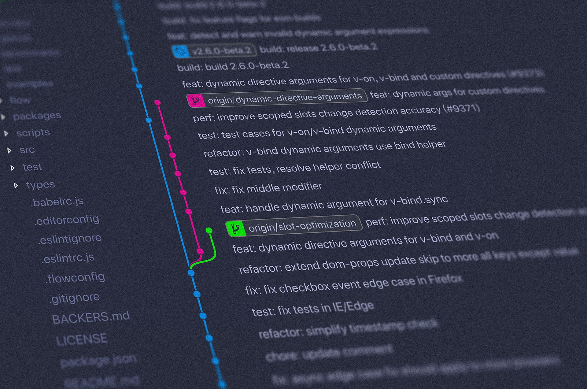
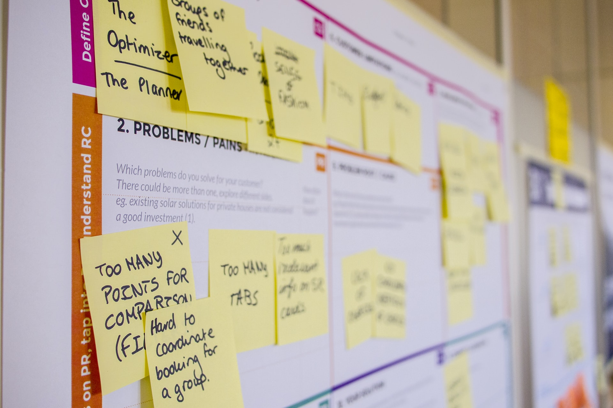

Let's get started explaining some day-to-day jargon used in the software development community, which should make your beginners
days as easy as possible.

> Pretty much all the topics listed below are significantly simplified for the sake of easier understanding.
> The idea is that you, as a reader, will be able to find more information about each topic online.

<!--truncate-->

I remember I had significant frustrations at the very beginning of my career, being unable to understand quite some topics I
heard for the first time. With the time it got better, but if there was someone at that time to answer all of
the questions I had then - my life would have been much easier!

So, let me help you there!

## API

> A set of functions and procedures allowing the creation of applications that access the features or data of an operating
> system, application, or another service.

An application that's not integrated with a _file system_, _file system_, some _remote service_ (e.g **Facebook API**, **Github API** ...)
doesn't offer too much functionality on its own. An example of an API usage would be a backend application accessing the
local file system's APIs to read file contents, or a ReactJS frontend application accessing Github Rest API to fetch some
data to be presented on a web page.

It's a very common thing today one application communicates _with various APIs_.

## Docker


A piece of software which allows us to ship our software in such a way that the one who wants to use it doesn't need to
install or configure any other software to be able to use our software, apart from the **Docker** itself.

The idea is to package our software in a **Docker** understandable format, and then push it to some **online registry**, where
others can take it and use it.

## Version control / Git

Version control refers to the ability to control the versions of the **digital artifacts**, whatever it may be (e-books, word docs,
mp3 files...).

In the software development sense, we're talking about the ability to manage versions of our software, as we change it.

Version control systems do not need to be exclusively used for code management: we can use it to version our images, word
documents or any kind of digital artifact.

The advantage of versioning is the ability to track the progress of some software product, but also by versioning we have
a chance to easily jump from version to version and that may come handy in case we introduce a bug in version `1.4.2`,
but luckily we know that a version `1.4.1` worked just fine.

**Git** is a cross-platform software which technically enables us to manage software changes, by creating new versions.

Git as the software is what behind the scene powers services, such as **Github**.

## Open-Source

Every piece of software is based on some source-code that was written for it to be able to execute. There are 2 kinds
of the source-code:

- Closed-source

Examples of these would be **Windows Operating System** code-base, **MacOS** one, etc. Closed-source is mostly developed by the
companies which **do not want to publish** their source-code, because the code is their competitive advantage, and brings
them financial income.

- Open-source

The opposite side, which promotes values of public visibility of the code, so that everyone can access and view it.
An additional step is an ability for everyone **to change the code**.
This lead to the enormous popularity of public tools, like **Github** or **Bitbucket**, which provide an easy way for people to
collaborate on software projects as well as to share code from each other.

## Merge / Pull requests


A means (formal process) of contributing to the existing code-base. The process looks like this:

- There is an existing software code-base
- User **A** wants to extend existing functionality / fix existing bug
- (S)he prepares a bugfix or a feature on own development machine
- There is a User **B** who is considered a project maintainer (the one who knows the project well and ensures its quality)
- User **A** informs User **B** that (s)he wants the new feature/bugfix integrated, which is a formal process (most often)
performed via Web UIs provided by the source-code hosting platform, e.g **Github**, **Gitlab**, **BitBucket**, etc

## Synchronous / asynchronous execution

Synchronous might be more easily understood if we use term **blocking** instead. Some things need to be synchronous/blocking
by their nature. Imagine you have a sample code:

```javascript
function completeCheckout() {
  storeOrderInDb(); // takes 2s
  transferToOrderManagementSystem(); // takes 3s
  sendConfirmationMail(); // takes 3s
}
```

Ideally, we should **not design** our systems to be synchronous / blocking. If, in the example from above, we decide that all 3
functions `storeOrderInDb`, `transferToOrderManagementSystem` and `sendConfirmationMail` are synchronous, than user will have to
wait `8` seconds in total until he gets a response from the server.

If you, instead, decide that only the first method, `storeOrderInDb` is synchronous, and other 2 aren't, that means that user will
have to wait only 2 seconds, until his order is successfully stored in the database, and his order will eventually be sent to order
management system and he will get a confirmation e-mail (this can wait a bit, and the user doesn't need to get this done immediately).

A good rule of thumb would be that we should design for asynchronous, and the user should not be blocked unless there is a valid reason to do it.

## Software versioning

Software evolves over time.

It gets bugs fixed and new features added, as well. It can be that, for whatever reason, some
user wants to use the first version of our application, whereas some other user wants to use the latest one.
We need a way to store our updated software alongside its version somehow.

There are a couple of versioning schemas, I believe the most relevant one is called a **Semantic versioning**.

One additional reason to have versioning schema in place is an easier
way to rollback some software that contains a bug for example, to a previous, known to work version. So, if we have rolled
application version `1.2.3` and we want to roll it back, we could simply, from our software registry pull the version `1.2.2`
and roll it out to the customers.

## Logging

When developing our applications (mostly backend systems), it's very important that during the application runtime execution we
preserve some sort of messages containing **important information about a system or user behavior**.

An example would be that if a user enters 3 times wrong login credentials we store this message so that we can troubleshoot/diagnose given
use-case. The recommended way of doing it would be writing these messages to the standard out (console), which can later be searched through
when needed.

Another case would be that in case our code talks to the database, and there's a connectivity issue, we could store the message, something
along the lines: "There was a connection timeout connecting to the database x.y.z".

Often, these logging libraries contain various logging levels, such as `DEBUG`, `INFO`, `FATAL`
which help us set the importance of the things we are logging: we can then, for instance,
filter logs which are considered `FATAL` and then do the analysis and the troubleshooting.

## JSON

`JSON` is a **human-readable** and a **portable** **data serialization format** . It's famous for being used for a data interchange between
browsers and servers, but not exclusive to that.

An example of `JSON` serialized (formatted) data would be:

```json
{
  "type": "order",
  "id": 12345,
  "total": "255.59$",
  "items": [
    {
      "name": "Ipad Pro",
      "quantity": 2
    },
    {
      "name": "Dell XPS 15",
      "quantity": 3
    }
  ]
}
```

`JSON` provides a couple of data types, such as `strings`, `numbers`, `objects`, `arrays`, and all of them together are enough to
express any sort of data, which is one of the reasons why it's heavily used (apart from human readability).

## Request / Response


Very popular interaction model between two (software) parties, where one side (**client**) initiates the communication by **sending a request**
to the other party (**server**) which upon understanding and processing the request sends a **response** back to the client.

## Scalability

A frequently used term is software scalability, which is an ability of the software to cope with the ever-increasing load, often as
consequence of an increased number of users using the software. Applications should be designed in such a way to be able
to handle the increased usage.

## Abstraction

You will very frequently come across this term, as0 you progress in your career.
Abstraction is a fancy name for **hiding some complexity under some name**. What does that mean?

Suppose we have a method

```javascript
const getUserDetails = (userId) => {
	const baseUserData = await http.get("https://api.users.com/users/${userId}")
		.header('Accept', 'application/json')
		.header('X-API-KEY', 'xxxx-yyyy')
		.call();
	const dbRow = dbClient.connect('my-database').executeQuery(
		"select * from users where user_id = ${userId}"
	).first();
	return {
		...baseUserData,
		...dbRow
	};
}
```

This method, as you may guess by being patient enough to read it entirely combines user data from the two datasources: `HTTP` API and the
database. This imposes non-trivial cognitive load on the reader, which we may reduce by introducing abstractions:

```javascript
const getUserDetails = (userId) => {
	const baseUserData = getBaseUserData(userId);
	const dbRow = getDatabaseDetails(userId)
	return {...baseUserData, ...dbRow};
}
const baseUserData = (userId) => {
	const baseUserData = await http.get("https://api.users.com/users/${userId}")
		.header('Accept', 'application/json')
		.header('X-API-KEY', 'xxxx-yyyy')
		.call();
}
const getDatabaseDetails = (userId) => {
  dbClient.connect('my-database', 'my-username', 'my-password').executeQuery(
		"select * from users where user_id = ${userId}"
	).first();
}
```

Here, we reduced the cognitive load to the user by hiding all the lower-level details under two abstractions: `baseUserData` and `getDatabaseDetails`.
The immediate advantage is that understanding `getUserDetails` function is no longer a complex task. Another advantage is that two newly created
abstractions can even be reused in some other place in our applications.

This is just a short intro to abstractions, which is something you will likely master throughout your career.

## Upstream / downstream


You will hear these terms relatively often: **upstream server** - **downstream server**.

Or **upstream job** - **downstream job.**

I was having difficulties with this one until I came across the article that simplified this one for me:

> Upstream is a message sender. Downstream is a message receiver.

Imagine you have an `HTTP` client and an `HTTP` server.

In the case of:

- `HTTP` request triggered by the client, **the client is upstream** and **the server is downstream**
- `HTTP` response to this request, `HTTP` server is upstream, and `HTTP` client is downstream

You can also hear **upstream job**, **downstream processing**, etc.

## Database


We use databases when we want to have some **long term accessible data**. There are many database solutions out there, optimized for particular
use-cases.

Databases ensure that the data we put there stays there **as long as they are needed**. Often, these databases ensure that the
data persisted is also backed up, to ensure there's no data loss.

Apart from the ability to store the data, the databases provide a way to query the data and access it.

Two very popular types of databases nowadays are **relational** and **document** databases.

Associated with databases is the so-called `CRUD` acronym. It refers to `C`reate, `R`ead, `U`pdate and `D`elete, that are the actions we can perform over database content.

## HTTP


Means for reliable exchange of text-based, human-readable content between different applications.

The core of `HTTP` communication is the **client/server** and **request/response** pairs. The communication goes like:

- **HTTP client** application (say, your browser) sends a `HTTP Request` to a remote **HTTP server**
- **HTTP Server** receives the requests, and responds with an `HTTP Response` which then client handles in some way.

An example of the `HTTP` communication would be the one between **a browser** and **a server** needed to fetch resources for rendering
web page: `html` documents, `css` styles, `JavaScrtipt` scripts, `Ajax` requests, etc.

The most important part of `HTTP` is the **URL**, which is a location of a remote resource we are communicating with, for instance
`http://www.twitter.com`.

`HTTP` supports the concept of **verbs**, such as `GET`, `POST`, `DELETE` which provides a way to express more clearly what do try to do with
the remote resource, like **getting** some resource, **deleting** it, and so on.

## Rest API

Rest `API` is layer sitting on top of the `HTTP` protocol, which is based on the concept of **resources**.

Rest `API`, like any other `API`, is used to build applications by integrating with them. In this case, integration is done using the `HTTP` client.

Many popular platforms today, like **Facebook**, **Twitter** or **Github** provide their `API`s, which they use themselves (e.g.
**Facebook** website or their **Android** and **IOS** mobile applications are consuming their `API`), but also to be consumed by the others.

As mentioned, **resources** are a central concept in the Rest `API` world. One resource can be (let's use Github `API` as an example) a
**repository**, and Github `API` states that we can manage particular repository via their `API`s, by accessing **particular URLs** and
sending **correct input data** using proper `HTTP` verbs.

Apart from Rest `API`s, there are also emerging **GraphQL** `API`s, which are also sitting on top of `HTTP` protocols but differ in
philosophy of how the data should be accessed and managed.

## IDE



Stands for an **I**ntegrated **D**evelopment **E**nvironment, which is a piece of software used to develop applications. Some popular
ones: **Visual studio code**, **IntelliJ IDEA**, etc.

**IDE**s differ from classical text editors by offering way richer set of refactorings, and way deeper
awareness of the frameworks and programming languages.

## Agile development



**Agile development** refers to the way the work is organized nowadays when developing software. This is more like ideology, and there are a couple of concrete
methodologies present: **Scrum**, **Kanban**, etc.

The idea is that software should be **changed frequently, in small increments**, so that each increment can be validated by the user
as soon as possible.

By being able to frequently release smaller software increments, we can get the feedback from the users, but also we are able
to more easily recover from the bugs we may have introduced (since the scope of small changes allows for
easier troubleshooting).

## Testing


Testing is the formal process of asserting software quality. Ideally, we want to test the things ourselves, before we hand our software to
our customers so that they can use and test it themselves.

In general, we have two types of tests:

- Manual

Manual testing involves 1 or more people testing applications by hand, by interacting with the
mobile application, or browser-based websites, by going through a series of scenarios
(use-cases) and asserting that what was expected happened. This testing category is very expensive,
and error-prone on top (anything involving people is risky), so it should be minimized.

- Automated

This group of tests should be the desired way to test the software before releasing it.
The idea is to **write a set of tests** that can be executed **by machines**, thus they will be much faster and less risky than when
performed by people.

One test, implemented in some programming language (let's say **Python**), interacts with our software, gets the results of that
interaction, and asserts that results match expectations of such an interaction.

These automated tests can further be divided on **unit tests**, **integration tests** (there's no consensus on what types of tests should
exist and how should they be named at the time being)

## Debugging

Debugging is most often used in those cases when we want to **troubleshoot some issues** we have with our application. Technically speaking,
debugging is a **mode in which we can start the application** so that we can inspect its behavior during the execution.
There is also a concept of **breakpoints**, which are the points in code (concrete lines in source files) we'd like to pause application
execution.

How it works:

- Set a breakpoint in the source file's concrete line you'd like to pause your application's execution
- Trigger the application flow that would cause the line you set to be executed
- When the execution reaches your line, it will pause there, giving you control to:

  - resume it
  - inspect all the variables (global, local)
  - continue line by line
  - step into functions...

This is mostly used by developers on their machines, but sometimes it's also possible to debug processes running on remote machines.

## Compiling

Many programming languages (like **Java**, **C#**) require us to create an intermediary representation of code, which is both required and
optimized for the runtime and is the representation that is required to run the applications written in these languages.

For instance, in case of **Java** programming language, we need to transform **Java** source code files into **Java bytecode** files. These are
later used to run our application using **Java runtime environment**

There are also languages, such as **JavaScript** for instance, that does not require us to prepare any intermediary representation, but
instead, source files are directly used by the application execution runtime (in case of **JavaScript** - a browser or **NodeJS**).

## Client / Server

This is one interaction model (out of a few ones) between the two software parties (processes) where:

- **client** is the party which **initiates communication** with the server
- **server** is the party which responds to the requests sent by the client
-

This interaction model you can find, for instance, in web browsers, where **the client** (the browser itself) requests web resources
from the web-server (which is **server** in this case)

Servers never initiate this interaction.

## Deployment

Deployment is a process of installing your software on a server, making it available for end-users. Deployment frequency and duration
can vary significantly between different applications, depending on software complexity, a technical debt of the applications, deployment
tooling efficiency, etc.

Companies are deploying their software several times during the day, but some companies deploy very rarely, once in a
month, or even more rarely.

The deployment should, ideally, be an automated process, consisting of various testing phases, packaging and versioning software release,
installing it on a server, and performing some health checks to ensure the success of the deployment

## Caching

Caching is a process of remembering values of some **time-taking or resource expensive computations** so that they can be reused for the
subsequent, **identical** calls.

In some systems, querying a database is a very expensive operation time-wise, and we might want to cache some results that can be cached.

For instance, imagine we have an e-commerce platform, and we want to present categories to the users, which are coming from the database. These categories
are not changing so frequently, so we might want to protect our database server being querying each time each page is displayed for each
user by caching these results once they are returned from the database the first time.

We often store this cached value in server memory, or we can put this information to the external tools, such as **Redis** or similar,
which have much better read performance than the databases.
