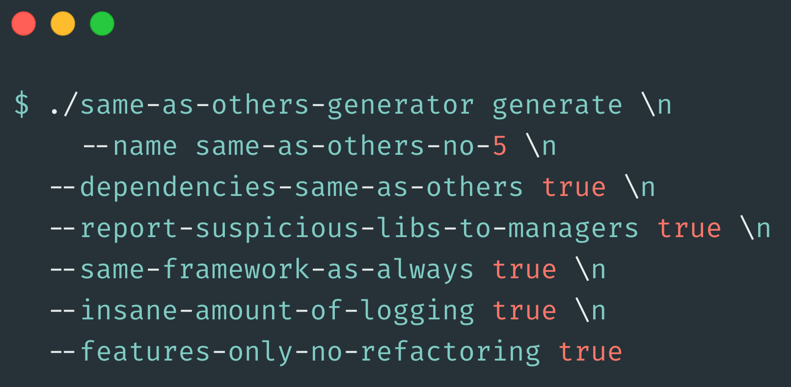

Let’s think of an imaginary company that has a product, built as a software monolith. This is not hard to imagine, right?

So, now let’s imagine a situation where the time comes for the company to slice the product technically, into a set of independent services.

The reason may be that codebase becomes hard to manage due to too big complexity, technical debts, or different scalability required for some parts of the application.

<!--truncate-->

Whatever the reason - the decision has been taken, so here we have a micro-services around the corner.

Let’s also imagine that the company has around 60 developers in total. So, the course of action has been taken, now it’s time for execution!

Management decided to split the team into 10 independent teams.

The teams are of average quality, some of them having more experienced engineers, some having none. Some have Ops, some don’t.

Management decides to form a separate Ops team, where all the Ops experienced engineers would go. Teams would stay as pure software development teams.

The business spent time upfront to slice use cases into a series of micro-services. The teams were given responsibilities for new services, the time for coding has come.

## Common technology choice to the rescue!

Having quite some people organized across many teams, and being uncertain whether individual teams can be efficient in delivering their portion of the software, business feels like there needs to be a way that would address this concern.

Individual teams, indeed, seem to be under-educated for what’s given to them. After all - up until recently they used to work on old technology stacks that are running behind some modern trends.

Since there is a fact that teams should be efficient as soon as possible, technology department takes a very important decision to mitigate this issue: to maximize the efficiency of the overall process, current trends have been analyzed to make proper framework choice, so that all the teams should follow the same process and use the same tooling.

The mainstream programming language has been chosen, as well as a mainstream micro-service framework to be used. This sounds like a sane decision, which may address current issues. Having mainstream technologies being chosen should make sure that the portability between teams is high, which should help when one team needs additional capacity and the other team has already engineers that can immediately jump in - they already know the programming language and the framework of choice.

Technology heads bring experienced people in and give them a task to create some kind of a blueprint for creating a new micro-service project which already contains some samples of how people should be doing their coding, in the light of new technologies and their best practices.

The engineers worked hard and came up with a project creator tool which you just need to provide the name of your service, and it generates a new project with all the samples needed to figure out how to code services using the latest technologies. It shows how to create an API layer, how to talk to a database, how to use the messaging system, etc.

Great! :blush:

On top of the decision to have a common language and framework, there was an additional problem in front of the technology department: the company decided to use a Continuous Delivery approach for software delivery.

There were just a few people across the teams who even knew what that even means! That’s quite some obstacle now, which needs to be addressed somehow.

## Common pipeline to the rescue!

Heads of technology organize engineers that know how to make continuous delivery pipelines and hands them over a task to create a pipeline that will just be used as is by all the teams so that they can be isolated from dealing with this software development aspect.

They sat together, defined all the mandatory steps pipeline should go through. What felt strange at that point is that this knowledge was pretty much academic, kind of, since these things usually emerge as time passes.

Also, what felt unusual at that point is the assumption that all the teams need the same steps being passed for their components to be deployed.

## Software development requires skills

The teams started using provided facilities. New projects based on blueprint got created, with the pipeline included, you could just focus on coding.

There was magic all around! You code and your things get deployed.

But, then things got complicated.

> **Team A** came to the blueprint creators reporting that in some environments they can’t connect to the database.

> **Team B** said that there may be some caching involved since they happen to see some cached data, which hasn’t been invalidated.

> **Team C** reported that their pipeline failed to deploy due to some Sonar tool reported bad quality of their components, asking if that can be configured so that it’s turned off for their team.

> **Team D** reported that they were told that if they just write some database entities their code should talk to MongoDB without any issue, which doesn’t happen and they never used that library coming from their blueprint project and they do not know how to fix that...

Quite some pain!

The issue was that original blueprint project creators implicitly became technology owners with the time: they provided tooling and samples, and that made people working across teams believe that they should just report the issues to them, and they will be immediately available to work on them.

But that wasn’t the case: these engineers just moved to other projects in the meantime. They weren’t there to support teams at the times they needed them. Some teams even challenged why they provided some support in the way they provided since there were many other easier to use tools.

People across teams even started reporting to technology leads that blueprint creators didn’t do their part well and that they weren’t there to support them when issues pop up.

Some teams wanted to use libraries in their projects that weren’t compatible with the libraries coming from the blueprint project.

One team wanted to use some lightweight framework instead, but they could not find any specification on what needs to provide on top of their service, which comes out of the box when using a blueprint based project. They had to reverse engineer blueprint project to figure out what they needed to do for their project.

The other team complained that they don’t need all the steps that pipeline goes through for their service. They said also that pipeline takes too long to complete, without adding value.

There was also a team that had to use a maven compiler plugin which is the only one available to fit their needs, but unfortunately, the blueprint project was based on the Gradle build system.

## The power of education, training, and independent teams

The things did not go as well as expected.

Teams were slow.
The quality was bad.
Delivery was delayed.

The fact that there were a sample project and an existing pipeline helped engineers that were allowed to be lazy to learn things on their own. The things just worked for them.

The best engineers started leaving the company. The fact that things had to be unified didn’t let them design software with a good quality they were capable to deliver.

They had no way to express their creativity. They weren’t allowed to use the best tool for their scenarios.

They lacked recognition and pride in what they do.

## The good parts

Well, there some really good sides to having a common approach to solving problems. The fact that a developer can be able to support another team without a significant ramp up time is really valuable.

Also, what comes handy is that very likely, in case you come across any issue, someone from within your company will be able to support you, without a need to ask for help online.

Finally, in case you enjoy the technology chosen to be used, you will have a fantastic environment to sharpen your skills and learn from many folks around.

## Was there any other way around?

Software development requires skills. Was always so. There is no way to protect engineers against knowing how things work.

Current trends in software engineering state that they to scale technology as the business itself need to scale are to form independent teams.

These teams are responsible end to end for their software components. From their machine to the production environments.

That means that a team is capable of doing everything needed on their own.

Development included.
Deployment included.
Testing included.
Troubleshooting included.
Performance tuning included.

There’s no other way around. Having special teams trying to protect other teams from some development aspects will never work.

Building abstractions that simplify developer life hardly ever works, especially within companies, where these abstractions come with a great price to pay.

There’s no blueprint project so that you don’t have to bother.
There’s no common pipeline for everyone. You can always copy-paste the things you like from the others.

By having a diversity of decisions, technologies, tools, and processes, we learn. And we figure out with the time what works well. Then it can become some sort of company standard, which can be used by many teams.

No one can foresee the future and be prepared for it upfront.

Instead, encouraging environment for learning, trying out and failing. Learn out of it.

That was all for today! Hope you liked it!
